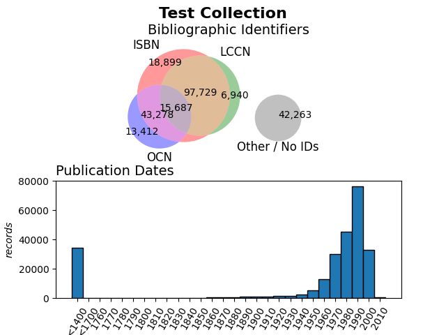

# plotMARC

A command line tool to visually characterise a bibliographic collection in terms of publication dates and available bibliographic identifier coverage.

## Basic usage

From a directory containing one or more binary [MARC21](https://www.loc.gov/marc/bibliographic/) format for bibliographic data files (with extension `.mrc`)
representing a bibliographic collection, run:

    ./plotMARC.py
    
The script will process the MARC files using [pymarc](https://gitlab.com/pymarc/pymarc),
and produce a single `<directoryname>.png` image containing a 3-way Venn diagram displaying the number of records with the following bibliographic identifiers:
  
* ISBN
* OCN ([OCLC](https://www.oclc.org/) number)
* LCCN ([Library of Congress](https://loc.gov/) number)
  
and a histogram showing the publication dates in the bib records.

### Example output




```
Summary for Test Collection:
Record counts for bibliographic identifiers present in this collection:
Total:  248632	100.00%
ISBN:   175593	 70.62%
LCCN:   130780	 52.60%
OCN :    82801	 33.30%
No Id:   42263	 17.00%
```
  
## [Requirements](requirements.txt)
 
* [pymarc](https://gitlab.com/pymarc/pymarc)
* [matplotlib](https://matplotlib.org/)
* [matplotlib_venn](https://github.com/konstantint/matplotlib-venn)
 
Install these using pip:
 
     pip install -r requirements.txt


## License
Copyright © 2022 Charles Horn.

This program is free software: you can redistribute it and/or modify it under the terms of the GNU General Public License as published by the Free Software Foundation, either version 3 of the License, or (at your option) any later version.

This program is distributed in the hope that it will be useful, but WITHOUT ANY WARRANTY; without even the implied warranty of MERCHANTABILITY or FITNESS FOR A PARTICULAR PURPOSE. See the [GNU General Public License](LICENSE) for more details.
